# Ehlers Indicators and Filters
A collection of John Ehlers technical analysis indicators and filters written in pure go
Every indicator includes tests and a graph on [synthetic data](https://github.com/MathisWellmann/go_timeseries_generator).

### Installation:
``
go get github.com/MathisWellmann/go_ehlers_indicators
``

### Indicators / Filters include:
- [FAMA](https://www.mesasoftware.com/papers/MAMA.pdf)
- [Laguerre Filter](http://mesasoftware.com/papers/TimeWarp.pdf)
- [FRAMA (Fractal adaptive moving average)](http://mesasoftware.com/papers/FRAMA.pdf)
- [Cyber Cycle](https://www.mesasoftware.com/papers/TheInverseFisherTransform.pdf)
- [Center of Gravity](https://mesasoftware.com/papers/TheCGOscillator.pdf)
- [Fisher Transform](https://www.mesasoftware.com/papers/UsingTheFisherTransform.pdf)
- [Inverse FisherTransform](http://www.mesasoftware.com/papers/TheInverseFisherTransform.pdf)
- ReFlex
- TrendFlex
- [MAMA (MESA adaptive moving average)](https://www.mesasoftware.com/papers/MAMA.pdf)
- [Laguerre RSI](http://mesasoftware.com/papers/TimeWarp.pdf)
- [Roofing Filter](http://www.mesasoftware.com/papers/PredictiveIndicatorsForEffectiveTrading%20Strategies.pdf)
- [Super Smoother](http://www.mesasoftware.com/papers/PredictiveIndicatorsForEffectiveTrading%20Strategies.pdf)

### Images:
With synthetic data from [MathisWellmann/timeseries_generator](https://github.com/MathisWellmann/timeseries_generator)

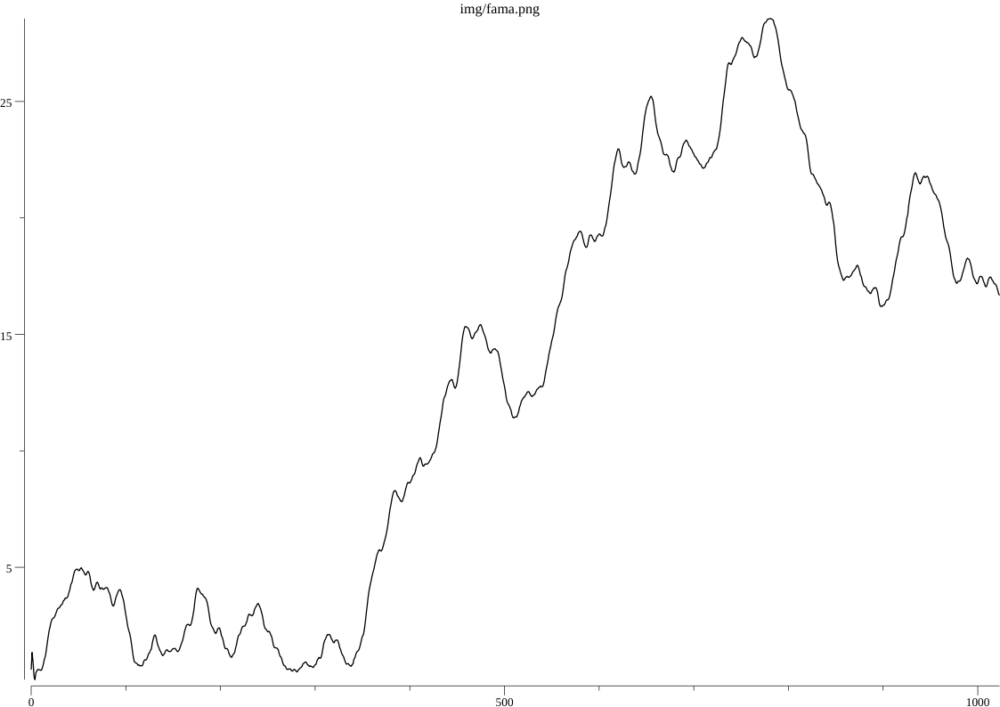
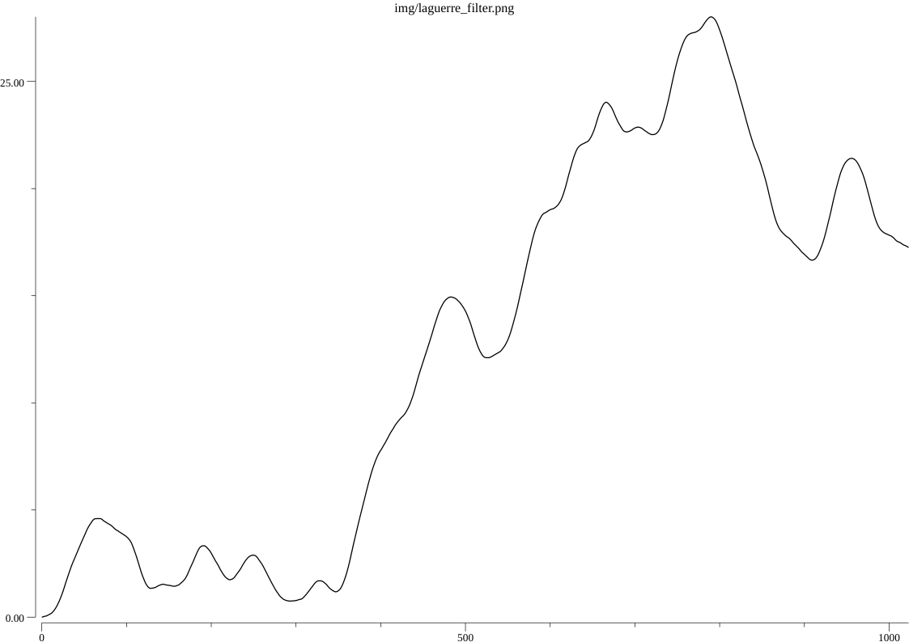
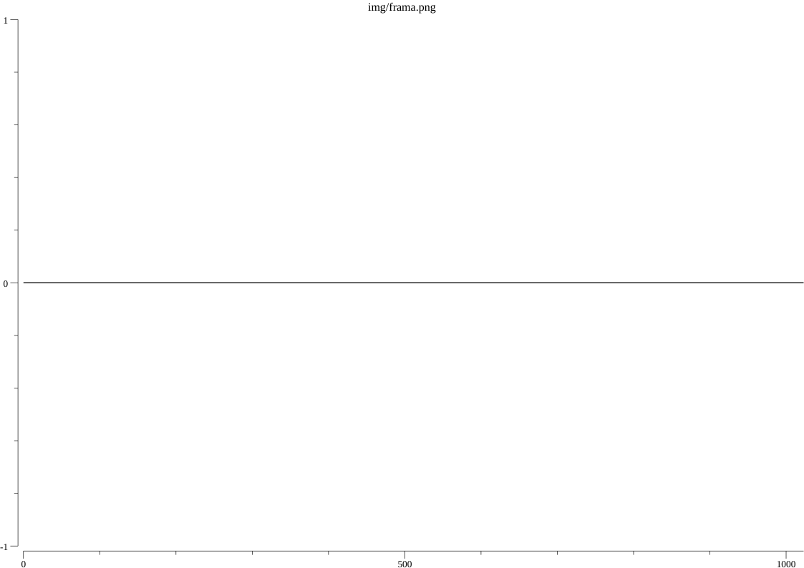
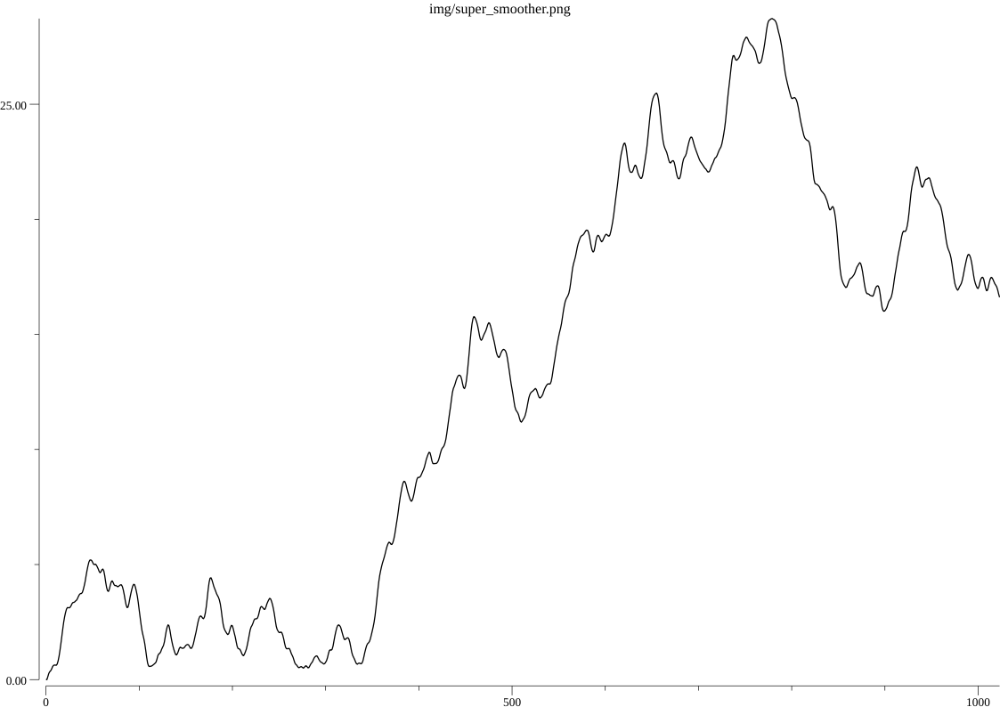
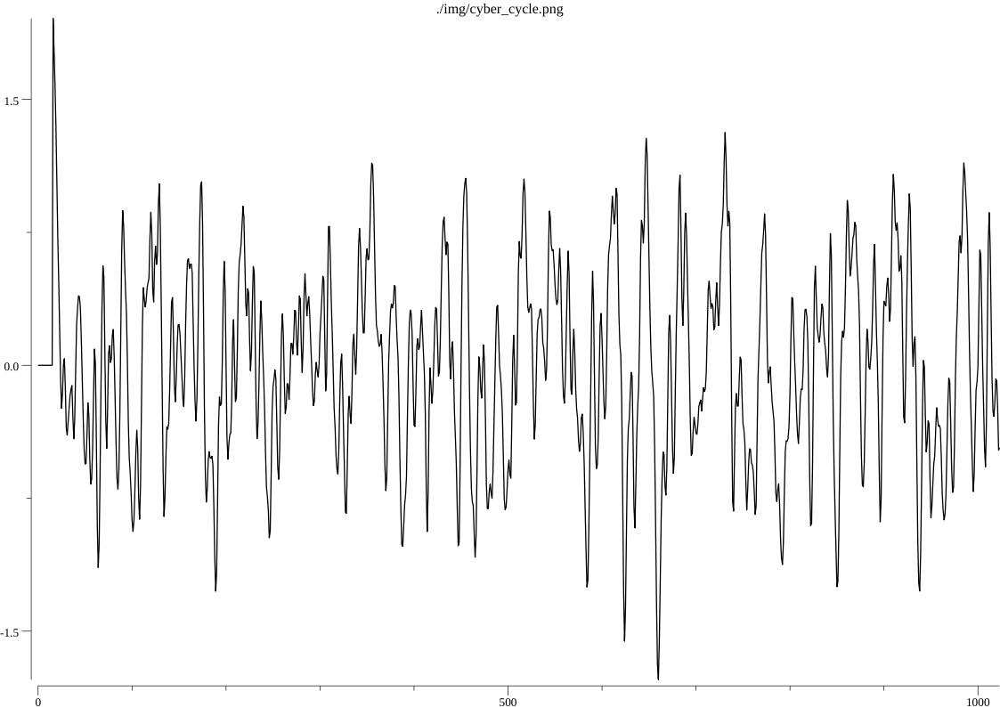
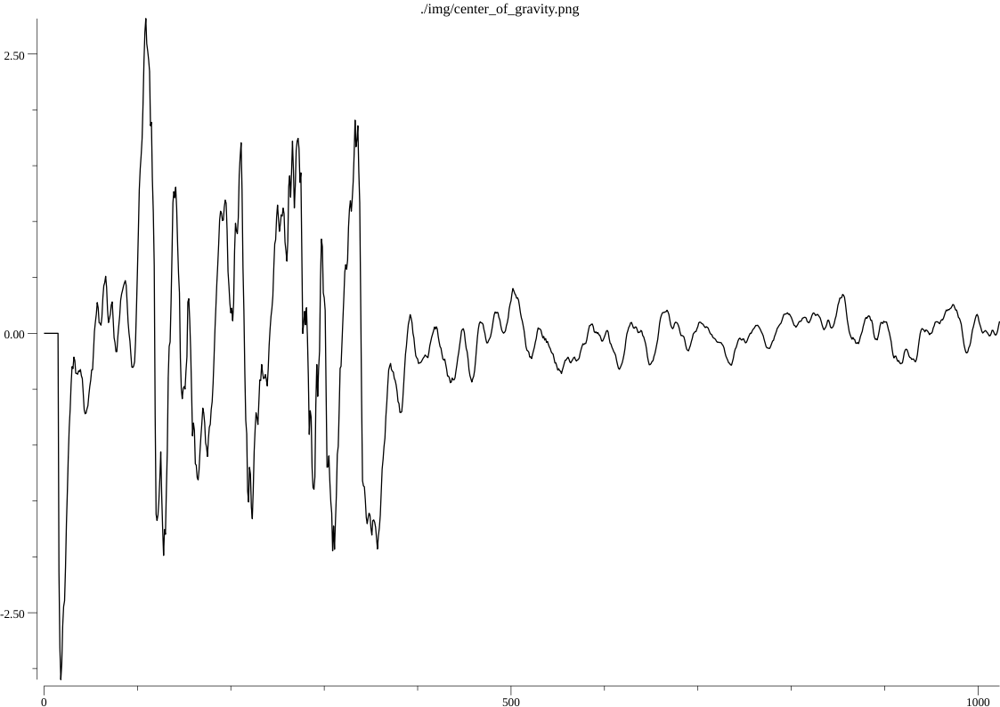
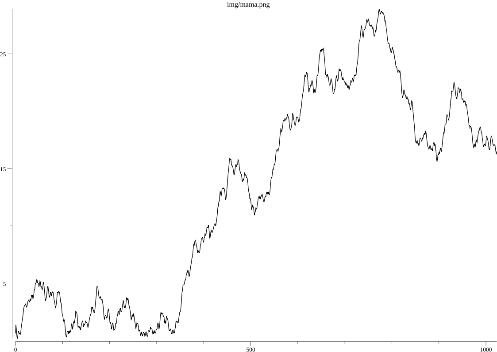
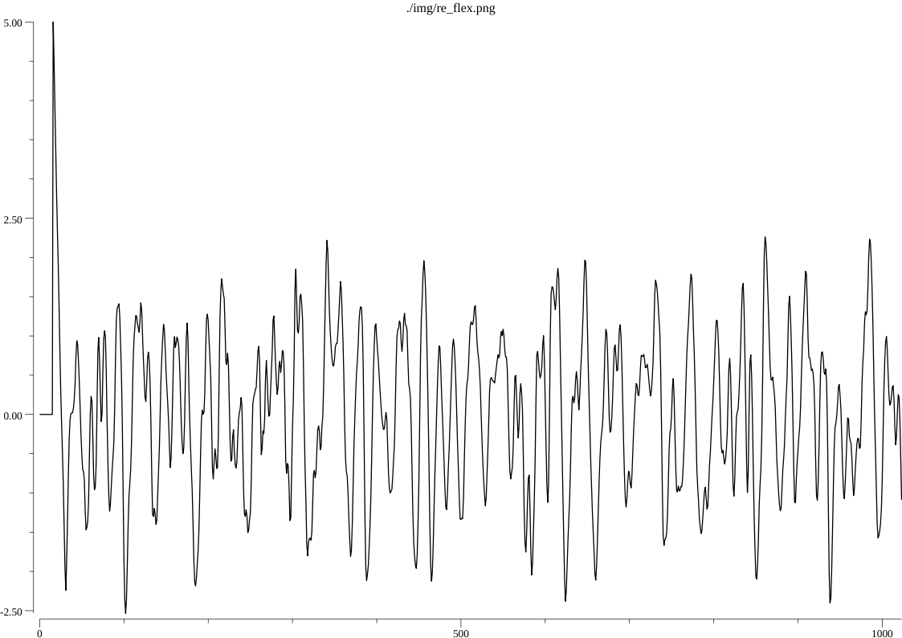
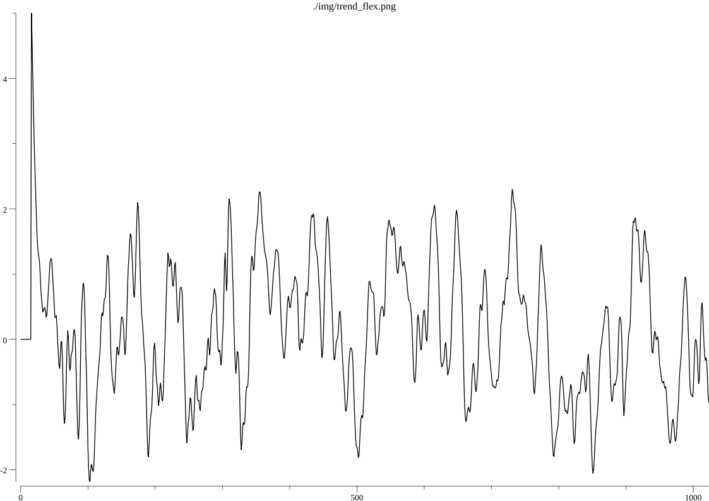
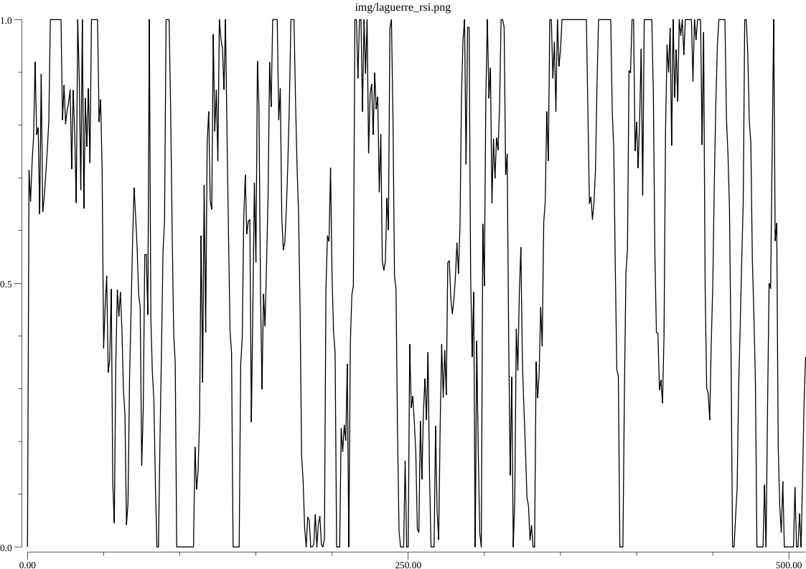
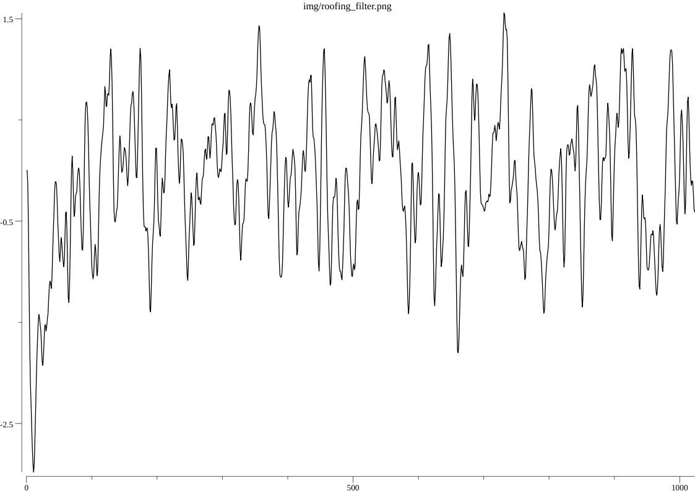
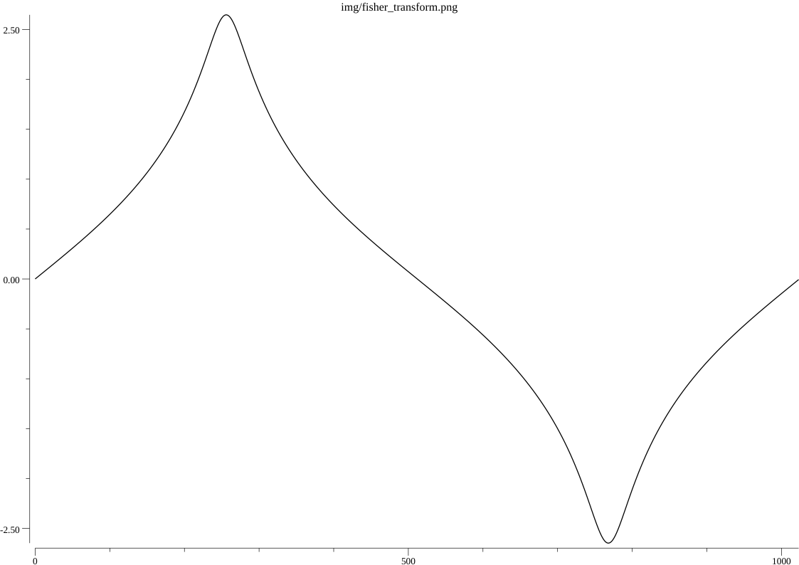
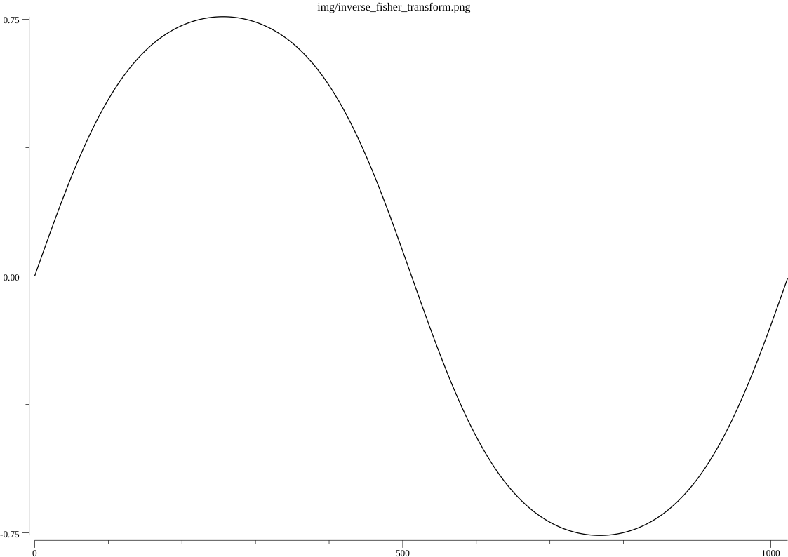

### TODOs:
- Swiss Army Knife Indicator
- Ehlers Filter
- Gaussian Filter
- (maybe) Empirical mode decomposition
- (maybe) Fourier Transform for traders

Feel free to post a pull-request for more indicators or in case I made a mistake.